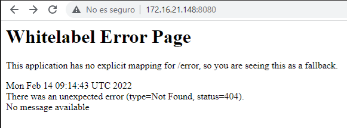
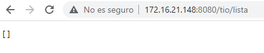
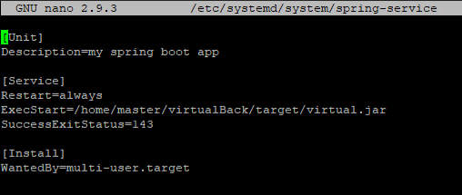
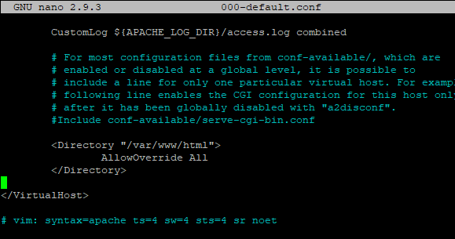
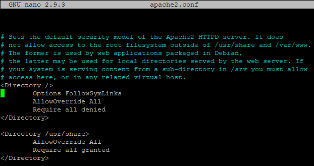
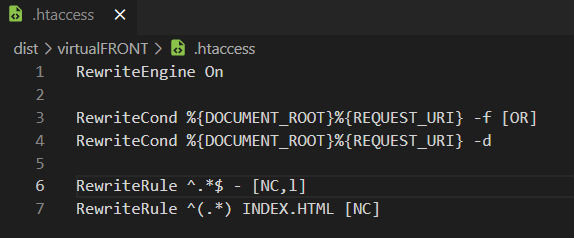
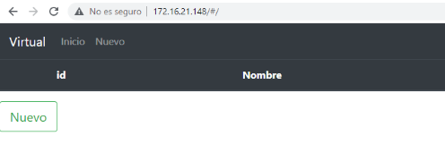

# Documentación Despliegue de Web Full Stack

> Trabajo realizado por Aitor Trillo Fernández, Serena Álvarez Agudo y Álvaro Jiménez Calleja.

[TOC]

#### Base de datos

En el servidor FTP instalamos mySQL-server y mySQL-client, modificamos la contraseña del usuario root por seguridad. Creamos al usuario que administrará la base de datos del proyecto y creamos la base de datos 'tarea_despliegue'. Le damos permisos al usuario sobre la base de datos. Por último, como usuario root, reseteamos los privilegios.

#### Spring - java

Instalamos maven y openjdk8.

#### Backend

Configuramos el servidor vsftpd, la opción `write=enabled` para que el usuario pueda modificar os archivos. Clonamos el backend del repositorio y lo subimos al servidor vsftpd con Filezilla. 
Mediante el comando `mvn clean`eliminamos la carpeta target, luego editamos el archivo pom.xml, convirtiéndolo en un ejecutable y le ponemos un nombre, 'tarea_despliegue'. 
Utilizamos el comando `mvn install -Dmaven.test.failure.ignore`  para construir e instalar el proyecto en el repositorio local. Modificamos el archivo `application.properties` para poner el nombre de nuestra base de datos.

- Accedemos a la aplicación, se puede ver la ip, el puerto y la aplicación funcionando

- El crud de Tíos (vacío)

Queremos que al iniciarse el servidor también lo haga nuestra aplicación, para ello creamos el archivo `spring.service` en `/etc/systemd/system/spring.service` añadiendo estas propiedades:

Y lo iniciamos con el comando `systemctl start spring.service`

#### Frontend

Instalamos apache en el servidor vsftpd, comprobamos que está habilitado y funcionando. Quitamos el index por defecto de apache, descargamos la parte del frotend de Github y, mediante Filezilla, lo transferimos al servidor, a la ruta `/var/www/html`. Construimos el proyecto de Angular, lo subimos al servidor Apache mediante Filezilla y actualizamos los permisos de /var/www/html recursivamente. Modificamos la configuración de Apache en /etc/apache2/sites-available añadiendo al archivo 000-default.conf el siguiente bloque directory.

Tras esto, reiniciamos el servidor Apache y vamos a configurar el archivo apache2.conf.

Creamos un archivo .htaccess en la carpeta virtualFront y configuramos:

Subimos el .htaccess al proyecto en apache y actualizamos los permisos de /var/www/html

#### Conclusión

Tras reiniciar apache, podemos acceder a nuestra aplicación desde el navegador:

#### Video -> https://loom.com/share/82131dc2dd00456c939db26c703a0d99

#### GitHub -> https://github.com/VaroJCalleja/DespliegueFullStack.git

